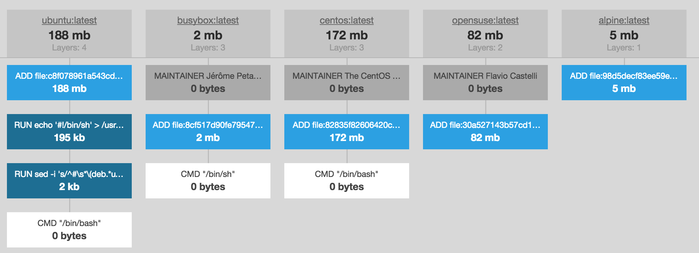
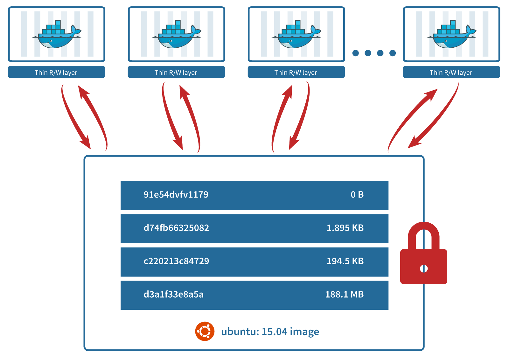

# Docker For Developers

## Steps

- What we learn here and How?
- What is Docker?
- The Docker platform
- Image and Container - A brief explanation of containers
- Virtual Machine vs Containers
- Architecture
- Image and Layer like branchs and commit in Git

### What we learn here and How?

- Run ~ Basic usage, create/run/stop/... containers, Deploy many kind of systems.
- Build/Package ~ Create image from files, scripts, compiled languages.
- Dev ~ Tips and Trick to use docker in development.

### What is Docker?

Docker is an open platform for developing, shipping, and running applications.

### The Docker Platform

Docker provides the ability to package and run an application in a loosely isolated environment called a container. The isolation and security allow you to run many containers simultaneously on a given host.

### Image and Container - A brief explanation of containers

An image is a lightweight, stand-alone, executable package that includes everything needed to run a piece of software, including the code, a runtime, libraries, environment variables, and config files.

A container is a runtime instance of an image—what the image becomes in memory when actually executed. It runs completely isolated from the host environment by default, only accessing host files and ports if configured to do so.

Containers run apps natively on the host machine’s kernel. They have better performance characteristics than virtual machines that only get virtual access to host resources through a hypervisor. Containers can get native access, each one running in a discrete process, taking no more memory than any other executable.

### Virtual Machine vs Containers

Containers can share a single kernel, and the only information that needs to be in a container image is the executable and its package dependencies, which never need to be installed on the host system. These processes run like native processes, and you can manage them individually by running commands like docker ps.

### Architecture

### Image and Layer like branchs and commit in Git

##### Layers in Image and Container

##### Image Size

##### Store Management

