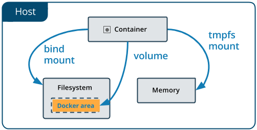

# My Static HTML Page Service

In this lab, you will learn how you can manage data/storage inside and between your Docker containers. In addition you will learn about container debugging.

## Steps

- Interactive mode & debug container
- Use bind mounts
- Use a volume in a container
- Use tmpfs mounts
- All learned in One

### Interactive mode & debug container

```sh
$ cd 002_staticPageFromFilesService
```

```sh
$ docker container run \
    --interactive --tty \
    --rm \
    ubuntu bash
```

```sh
> exit
```

Short version
```sh
$ docker run -it --rm ubuntu bash
```

##### Tips
- Use --interactive says you want an interactive session
- Use --tty allocates a psuedo-tty (tty = TeleTYpewriter)
- Use short cut version '-it' instead of --interactive --tty
- Use --rm to remove after complete the session
- type 'exit' to end session

```sh
$ docker run -d --rm \
    --name developContainer \
    ubuntu tail -f /dev/null
```

```sh
$ docker ps
```

Review running container
```sh
$ docker exec -it developContainer bash
```

##### Tips
- Commands for debug bash | sh
- Alpine does not have installed bash

### Use bind mounts


```sh
$ docker container run -p 80:80 \
    -v $(pwd)/data:/usr/share/nginx/html \
    nginx:alpine
```

Alternative using --mount flag
```sh
$ docker run -p 80:80 \
    --mount type=bind,source="$(pwd)"/data,target=/usr/share/nginx/html \
    nginx:alpine
```

```sh
$ nautilus http://localhost/
```

```sh
$ ls data
```

```sh
$ docker ps
```

```sh
$ docker exec -it <containerName> sh
```

```sh
> cd /usr/share/nginx/html
```

```sh
> cat "<h1><center>Docker For Developers<center></h1>" >> index.html
```

```sh
> exit
```

##### Tips
- It replace the container folder with source folder
- From new docker version you can use --mount for all cases

### Use a volume in a container


Create a volume
```sh
$ docker volume create data
```

Review the volumes
```sh
$ docker volume ls
```

Volume details
```sh
$ docker volume inspect data
```

Use the volume in container
```sh
$ docker run -p 80:80 \
    -v data:/usr/share/nginx/html \
    nginx:alpine
```

Remove volume
```sh
$ docker volume rm data
```

Alternative using --mount flag
```sh
$ docker run -p 80:80 \
    --mount source=data,target=/usr/share/nginx/html \
    nginx:alpine
```

##### Tips
- It takes the original files from container
- It is the recomended way to use data in containers
- It works on windows and linux

### Use tmpfs mounts


```sh
$ docker run -p 80:80 \
    --tmpfs /usr/share/nginx/html \
    nginx:alpine
```

Alternative using --mount flag
```sh
$ docker run -p 80:80 \
    --mount type=tmpfs,destination=/usr/share/nginx/html \
    -w /usr/share/nginx/html \
    nginx:alpine
```

##### Tips
- It is usefull when you need speed
- Use --workdir | -w to set working directory in the container

### Summary

Start Home Service
```sh
$ docker run -p 80:80 \
    -v "$(pwd)/wedding":/usr/share/nginx/html:ro \
    --name home \
    nginx:alpine
```

Open without cache (Ctrl + F5)
```sh
$ nautilus http://localhost/
```

Remove Home Service
```sh
$ docker rm -f home
```

Update the content and run again

##### Tips
- Use --volume | --v to bind mount a volume
- Use ':ro' to set read only
- Here you can find more details https://docs.docker.com/engine/admin/volumes/
